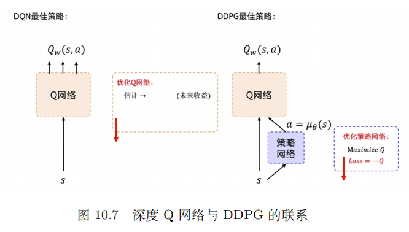
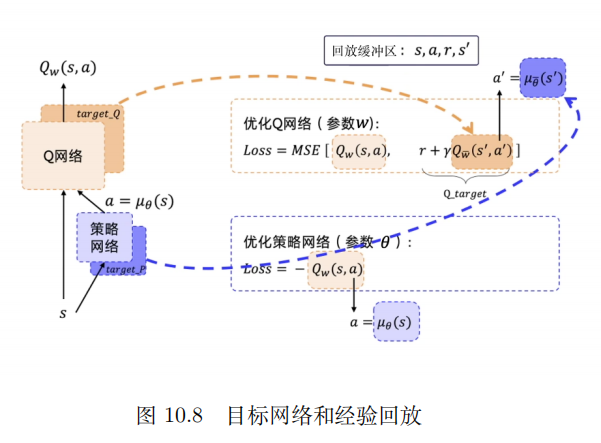

# DDPG

深度确定性策略梯度(Deep Deterministic Policy Gradient, DDPG)属于一种 [Actor-Critic](../Actor-Critic/Actor-Critic.md) 算法，并借鉴了 DQN 中的目标网络和经验回放，它适用于处理连续动作空间的问题。DDPG 使用神经网络作为策略函数，并通过计算梯度来优化策略, 以便训练并决定智能体的行为。该算法还使用了一个值函数来估算策略的价值，以便优化策略的参数。

REINFORCE 算法每隔一个回合更新一次，但 DDPG 是每个步骤都会更新一次策略网络，它是一个单步更新的策略网络。

如图所示，对于目标网络的更新，DDPG 在 DQN 基础上加了一个策略网络来直接输出动作值，所以 DDPG 需要一边学习 Q 网络，一边学习策略网络。Q 网络的参数用 w 来表示。策略网络的参数用 θ 来表示。这样的结构就是演员-评论员的结构。

**策略网络更新**: DQN 的最佳策略是想要学出一个很好的 Q 网络，希望选取的动作能使 Q 值最大。DDPG 也是想要求解出让 Q 值最大的那个动作，优化策略网络的目标是要最大化 Q 值，所以构造的损失函数是对 Q 取一个负号，写代码的时候把这个损失函数放入优化器里面，让优化器自动最小化损失，也就是最大化 Q。

**Q网络更新**: DDPG 优化 Q 网络的方法与 DQN 优化 Q 网络的方法是一样的。我们用当前步的奖励 r 和下一步的 Q 即 Q′ 来拟合未来的奖励 Q_target。然后让 Q 网络的输出逼近 Q_target。所以构造的损失函数就是直接求这两个值的均方差。构造好损失函数后，我们将其放到优化器中，让它自动最小化损失。

如图所示，我们把两个网络的损失函数构造出来。

* 策略网络的损失函数是一个复合函数，我们把 $a=\mu _\theta(s)$ 代入，最终策略网络要优化的是策略网络的参数 θ 。
* Q 网络要优化的是 $Q_\omega(s,a)$ 和Q_target 之间的一个均方差。但是 Q 网络的优化存在一个和 DQN 一模一样的问题, 就是它后面的Q_target 是不稳定的。此外，后面的 $Q_\omega(s',a')$ 也是不稳定的，因为 $Q_\omega(s',a')$ 也是一个预估的值。为了使 Q_target 更加稳定，DDPG 分别给 Q 网络和策略网络搭建了目标网络，即 target_Q 网络和 target_P 策略网络。target_Q 网络是为了计算 Q_target 中 $Q_\omega(s',a')$ 。 $Q_\omega(s',a')$ 里面的需要的下一个动作 a ′ 是通过 target_P 网络输出的，即 $a'=\mu _\theta(s')$ 。因此，DDPG 有 4 个网络，策略网络的目标网络和 Q 网络的目标网络只是为了让计算 Q_target 更稳定，因为这两个网络也是固定一段时间的参数之后再与评估网络同步最新的参数。

**经验回放**: 训练需要用到的数据就是 s、a、r、s ′，我们用回放缓冲区把这些数据存起来，然后采样进行训练。经验回放的技巧与深度 Q 网络中的是一样的。因为使用了经验回放技巧，所以 DDPG 是一个异策略的算法。

**采样噪声**: DDPG 通过异策略的方式来训练一个确定性策略。因为策略是确定的，所以如果智能体使用同策略来探索，在一开始的时候，它很可能不会尝试足够多的动作来找到有用的学习信号。为了让 DDPG 的策略更好地探索，我们在训练的时候给它们的动作加了噪声。一般我们添加不相关的、均值为 0 的高斯噪声。为了便于获得更高质量的训练数据，我们可以在训练过程中把噪声变小。在测试的时候，为了查看策略利用它学到的东西的表现，我们不会在动作中加噪声。

# 实现过程

在实现 DDPG 算法时，通常需要遵循以下步骤：

* 随机噪声可以用 $\mathcal N$ 来表示，用随机的网络参数 $\omega$ 和 $\theta$ 分别初始化 Critic 网络 $Q_\omega(s,a)$ 和  Actor 网络 $\mu_\theta(s)$
* 复制相同的参数 $\omega^-\gets \omega$ 和 $\theta^-\gets \theta$ ，分别初始化目标网络 $Q_{\omega^-}(s,a)$ 和 $\mu_{\theta^-}(s)$
* 初始化经验回放池 $R$
* for 序列 $e=1\to E$ do :
  * 初始化随机过程用于动作探索
  * 获取环境初始状态
  * for时间步 $t=1\to T$ do :

    * 根据当前策略和噪声选择动作 $a=\mu_\theta(s_t)+\mathcal N$
    * 执行动作 $a_t$，获得奖励 $r_t$，环境状态变为 $s_{t+1}$
    * 将 $(s_t,a_t,r_t,s_{t+1})$ 存储进回放池
    * 从 $R$ 中采样 $N$ 个元组 $\{(s_t,a_t,r_t,s_{t+1})\}_{i=1,\dots ,N}$
    * 对每个元组，用目标网络计算 $y_i=r_i+\gamma Q_{\omega^-}(s_{i+1}, \mu_{\theta^-}(s_{i+1}))$
    * 最小化目标损失 $L=\frac{1}{N}\sum_{N}^{i=1}(y_i-Q_{\omega}(s_{i}, a_i))^2$，以此更新当前 Critic 网络
    * 计算采样的策略梯度，以此更新当前 Actor 网络：

    $$
    \bigtriangledown_\theta J\approx\frac{1}{N}\sum_{N}^{i=1}\bigtriangledown_\theta \mu_\theta(s_i)\bigtriangledown_\alpha Q_\omega(s_i,a)|_{a=\mu_\theta(s_i)}
    $$

    * 软更新目标网络：

    $$
    \omega^-\gets \tau\omega+(1-\tau)\omega^-
    $$

    $$
    \theta^-\gets \tau\theta+(1-\tau)\theta^-
    $$
  * end for
* end for
