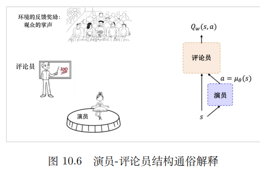

# DDPG

深度确定性策略梯度(Deep Deterministic Policy Gradient, DDPG)，是一种基于深度学习的强化学习算法，它适用于处理连续动作空间的问题。DDPG 算法与其他强化学习算法不同，它使用神经网络作为策略函数，并通过计算梯度来优化策略, 以便训练智能体的行为。

在 DDPG 算法中，策略函数用来决定智能体的行为，并输出一个动作。该算法还使用了一个值函数来估算策略的价值，以便优化策略的参数。

在实际应用中，**DDPG 算法通常与其他算法结合使用**，以便更好地解决复杂的问题。例如，它可以与经验回放算法一起使用，以便更好地管理内存。此外，DDPG 算法还可以与其他强化学习算法结合使用，例如 A2C 算法，以便更好地解决复杂的问题。

深度是因为用了神经网络；确定性表示 DDPG 输出的是一个确定性的动作，可以用于有连续动作的环境；策略梯度代表的是它用到的是策略网络。REINFORCE 算法每隔一个回合就更新一次，但 DDPG是每个步骤都会更新一次策略网络，它是一个单步更新的策略网络。

DDPG 是 DQN 的一个扩展版本，可以扩展到连续动作空间。在 DDPG 的训练中，它借鉴了深度 Q 网络的技巧：目标网络和经验回放。经验回放与深度 Q 网络是一样的，但目标网络的更新与深度Q 网络的有点儿不一样。如图 10.5 所示，DDPG 在深度 Q 网络基础上加了一个策略网络来直接输出动作值，所以 DDPG 需要一边学习 Q 网络，一边学习策略网络。Q 网络的参数用 w 来表示。策略网络的参数用 θ 来表示。我们称这样的结构为演员-评论员的结构。

通俗地解释一下演员-评论员结构。如图 10.6 所示，策略网络扮演的就是演员的角色，它负责根据环境目前的状态来输出一个动作。Q 网络就是评论员，它会在每一个步骤估计演员的动作未来能有多少奖励，也就是估计演员输出的动作的 Q 值，即 Q~w~(s, a)。演员根据评论员的打分来调整自己的策略，也就是更新演员的神经网络参数 θ。评论员则要根据环境的反馈奖励来调整自己的打分策略，也就是要更新评论员的神经网络的参数 w ，评论员的最终目标是让演员的表演获得观众尽可能多的欢呼声和掌声，从而最大化未来的总收益。

最开始训练的时候，这两个神经网络的参数是随机的。所以评论员最开始是随机打分的，演员也随机输出动作。但是由于有环境反馈的奖励存在，因此评论员的评分会越来越准确，所评判的演员的表现也会越来越好。既然演员是一个神经网络，是我们希望训练好的策略网络，我们就需要计算梯度来更新优化它里面的参数 θ 。简单来说，我们希望调整演员的网络参数，使得评委打分尽可能高。==注意，这里的演员是不关注观众的，它只关注评委，它只迎合评委的打分 ​==Q~w~(s, a)。

深度 Q 网络与 DDPG 的联系如图 10.7 所示。深度 Q 网络的最佳策略是想要学出一个很好的 Q 网络，学出这个网络之后，我们希望选取的那个动作使 Q 值最大。DDPG 的目的也是求解让 Q 值最大的那个动作。演员只是为了迎合评委的打分而已，所以优化策略网络的梯度就是要最大化这个 Q 值，所以构造的损失函数就是让 Q 取一个负号。我们写代码的时候把这个损失函数放入优化器里面，它就会自动最小化损失，也就是最大化 Q。

这里要注意，除了策略网络要做优化，DDPG 还有一个 Q 网络也要优化。评论员一开始也不知道怎么评分，它也是在一步一步的学习当中，慢慢地给出准确的分数。我们优化 Q 网络的方法其实与深度 Q 网络优化 Q 网络的方法是一样的，我们用真实的奖励 r 和下一步的 Q 即 Q′ 来拟合未来的奖励 Q_target。然后让 Q 网络的输出逼近 Q_target。所以构造的损失函数就是直接求这两个值的均方差。构造好损失函数后，我们将其放到优化器中，让它自动最小化损失。

如图 10.8 所示，我们可以把两个网络的损失函数构造出来。策略网络的损失函数是一个复合函数。我们把 a = µ~θ~(s) 代入，最终策略网络要优化的是策略网络的参数 θ 。Q 网络要优化的是 Q~w~(s, a) 和Q_target 之间的一个均方差。但是 Q 网络的优化存在一个和深度 Q 网络一模一样的问题就是它后面的Q_target 是不稳定的。此外，后面的 Q~w~(s ′ , a′ ) 也是不稳定的，因为 Q~w~(s ′ , a′ ) 也是一个预估的值。

为了使 Q_target 更加稳定，DDPG 分别给 Q 网络和策略网络搭建了目标网络，即 target_Q 网络和 target_P 策略网络。target_Q 网络是为了计算 Q_target 中 Q~w~(s ′ , a′ )。Q~w~(s ′ , a′ ) 里面的需要的下一个动作 a ′ 是通过 target_P 网络输出的，即 a ′ = µ~θ~ (s ′ )。Q 网络和策略网络的参数是 w，target_Q 网络和 target_P 策略网络的参数是w。DDPG 有 4 个网络，策略网络的目标网络和 Q 网络的目标网络是颜色比较深的这两个，它们只是为了让计算 Q_target 更稳定。因为这两个网络也是固定一段时间的参数之后再与评估网络同步最新的参数。

这里训练需要用到的数据就是 s、a、r、s ′，我们只需要用到这 4 个数据。我们用回放缓冲区把这些数据存起来，然后采样进行训练。经验回放的技巧与深度 Q 网络中的是一样的。注意，因为 DDPG 使用了经验回放技巧，所以 DDPG 是一个异策略的算法。

DDPG 通过异策略的方式来训练一个确定性策略。因为策略是确定的，所以如果智能体使用同策略来探索，在一开始的时候，它很可能不会尝试足够多的动作来找到有用的学习信号。为了让 DDPG 的策略更好地探索，我们在训练的时候给它们的动作加了噪声。DDPG 的原作者推荐使用时间相关的 OU 噪声，但最近的结果表明==不相关的、均值为 0 的高斯噪声的效果非常好==。为了便于获得更高质量的训练数据，我们可以在训练过程中把噪声变小。在测试的时候，为了查看策略利用它学到的东西的表现，我们不会在动作中加噪声。

# 实现过程

在实现 DDPG 算法时，通常需要遵循以下步骤：

1. 首先，需要定义策略函数(神经网络)和值函数。策略函数可以用来决定智能体的行为，并输出一个动作。值函数则用来估算策略的价值，以便优化策略的参数。
2. 然后，需要对智能体进行训练。在这个过程中，智能体会根据当前状态和策略函数的输出选择动作，并通过值函数的输出来计算优势值。这些优势值可以用来调整策略函数的参数，使得智能体的行为更加有效。
3. 在训练过程中，还需要使用折扣因子来计算未来回报的价值。这样，智能体就可以根据未来回报的预期价值来做出决策，并最大化获得回报的概率。
4. 当智能体完成训练后，它就可以在真实环境中应用了。在这个过程中，智能体会根据当前状态和策略函数的输出选择动作，并不断学习来调整其行为。

# In SB3

[Deep Deterministic Policy Gradient (DDPG)](https://spinningup.openai.com/en/latest/algorithms/ddpg.html) combines the trick for DQN with the deterministic policy gradient, to obtain an algorithm for continuous actions.

> As `DDPG` can be seen as a special case of its successor [TD3](https://stable-baselines3.readthedocs.io/en/master/modules/td3.html#td3), they share the same policies and same implementation.
>
> 由于DDPG可以看作是其继承者TD3的特例, 他们共享相同的 policies 和相同的 implementation。
