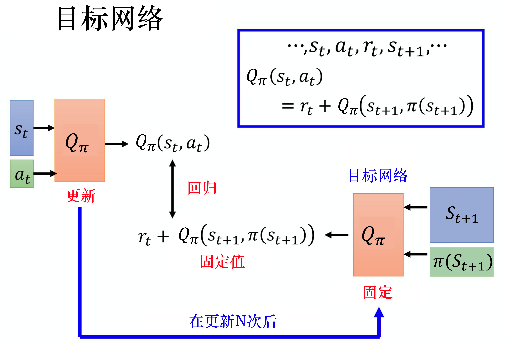
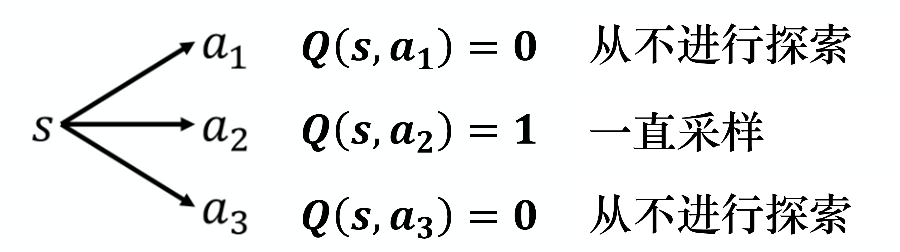
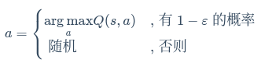

# DQN

传统的强化学习算法会使用表格的形式储存价值函数或Q函数，但面对连续的状态空间时，就不能再使用Q表格进行储存，而是要利用函数直接拟合价值函数或Q函数，降低对储存空间的要求。

我们可以用 $Q_Φ(s,a)$ 表示近似计算，称为**价值函数近似**（value function aproximation）。它通常是一个参数为Φ的函数，如神经网络，网络输出为一个实数，称为**Q网络（Q-network）**

**深度Q网络**（Deep Q-network, **DQN**）是指基于深度学习的Q学习算法，主要结合了价值函数近似与神经网络技术，并采用目标网络和经验回放等方法进行网络的训练。DQN算法的核心思想是通过学习数据来选择最优的行动，以达到最大化长期奖励的目的。

DQN 与 Q-learning 的目标价值以及价值的更新方式都非常相似, 主要的不同点在于：

1. DQN 将 Q-learning 与深度学习结合，用深度网络来近似动作价值函数，而 Q-learning 则是采用表格存储；
2. DQN 采用了经验回放的训练方法，从历史数据中随机采样，而 Q-learning 直接采用下一个状态的数据进行学习。

# 目标网络 target network

我们在学习Q函数的时候会用到时序差分方法的概念，例如我们在状态 $s_t$ 采取动作 $a_t$ 后，得到奖励 $r_t$，并进入状态 $s_{t+1}$。根据Q函数可知：

$$
Q(s_t,a_t)=r_t+Q(s_{t+1},π(s_{t+1}))
$$

我们希望Q函数输入 $s_t$、$a_t$ 得到的值，与输入 $s_{t+1}$、$π(s_{t+1})$ 得到的Q值之间相差 $r_t$，但实际很难做到。

如下图所示，我们把等式左边的 $Q_π(s_t,a_t)$ 作为网络的输出，$r_t+Q_π(s_{t+1},π(s_{t+1}))$ 作为目标，可以看出我们要去拟合的目标是会一直变动的，不好训练。

所以我们会把其中一个 Q 网络，通常是把上图右边的 Q 网络固定住。在训练的时候，我们只更新左边的 Q 网络的参数，而右边的 Q 网络的参数会被固定。因为右边的 Q 网络负责产生目标，所以被称为**目标网络**。因为目标网络是固定的，所以得到的目标值也是固定的。我们只需要调整左边Q网络的参数，这样就变成了一个回归问题，我们希望Q网络的输出与目标网络的输出越接近越好，这样会最小化它的均方误差（mean square error）。

在实现时，我们先对左边的 Q 网络更新多次，再用更新过的 Q 网络替换目标网络。但这两个网络不要一起更新，否则结果会很容易不好。

> 例如，一开始这两个网络是一样的，在训练的时候，我们先固定住目标Q网络，在做梯度下降的时候，只调整左边Q网络的参数。例如更新 100 次以后再把参数复制到右边的网络中，覆盖右边网络的参数，这样目标值就变了。就好像我们本来在做一个回归问题，训练一段时间后，这个回归问题的损失降下去一些，接下来我们把左边网络的参数复制到右边网络，回归的目标值发生改变，接下来就要重新训练。

估计值与目标值的距离会随着优化过程越来越小，最后它们就可以拟合，得到一个最好的Q网络。

# 探索

当我们使用 Q 函数的时候，策略完全取决于 Q 函数。给定某一个状态，我们就穷举所有的动作，采取让Q值最大的动作，即

$$
a=argmaxQ(s,a)
$$

其中,argmax(fx)就是函数fx的最大值点

用Q函数来决定动作与使用策略梯度不一样：

* 在策略梯度中，由于策略梯度的输出是动作的分布，我们根据这个动作的分布去采样, 所以我们每次采取的动作是有随机性的。
* 在Q函数中，假如我们采取的动作总是固定的，这不是一个好的数据收集方式。当我们要预测在某个状态采取某个动作会得到的 Q 值时，一定要在那一个状态采取过那一个动作，才能估测出它的Q值。对于没有见过的状态-动作对，它是估不出值的。假设在某一个状态，动作 a1、a2、a3 都没有采取过，那么估出来的 Q(s,a1)、Q(s,a2)、Q(s,a3) 的值可能都是一个初始值，比如 Q(s,a1)=0 、Q(s,a2)=0、Q(s,a3)=0

另外如下图所示，假设我们在状态 s采取动作 a2 ，得到的值是正的奖励，Q(s,a2) 就会比采取其他动作的Q值要大。之后再采取动作的时候，谁的 Q 值最大就采取谁，永远都只会采取 a2，不会采取其他的动作，这样是不可取的。所以我们需要有探索的机制，让智能体知道，虽然根据之前采样的结果，a2 好像是不错的，但我们至少偶尔也试一下 a1 与 a3，说不定它们更好。

这个问题就是**探索-利用窘境（exploration-exploitation dilemma）**问题，有两个方法可以解决这个问题：**ε-贪心**和**玻尔兹曼探索（Boltzmann exploration）**。

* ε-贪心是指我们有 1−ε 的概率会按照Q函数来决定动作，可写为

  

  通常将 ε 设为一个很小的值， 例如令 ε 等于 0.1，那么会有 0.9 的概率根据 Q函数来决定动作，有 0.1 的概率会随机选择动作。通常在实现上 ε 会随着时间递减，因为在最开始的时候，不知道哪个动作是比较好的，所以我们会着重于探索。随着训练的次数越来越多，我们已经大概确定了哪个动作是比较好的，这时我们就会减小 ε 的值以减少探索，主要根据Q函数来决定动作。
* 在玻尔兹曼探索中，我们假设对于任意的 s、a，Q(s,a)⩾0，因此 a 被选中的概率与 e^Q(s,a)/T^ 呈正比，即

  $$
  π(a∣s)=\Large \frac {e^{Q(s,a)/T}}{∑_{a^′∈A}e^{Q(s,a^′)/T}}
  $$

  其中，T>0 称为温度系数。如果 T 很大，所有动作几乎以等概率选择（探索）；如果 T 很小，Q值大的动作更容易被选中（利用）；如果 T 趋于0，我们就只选择最优动作。

# 经验回放 **experience replay**

经验回放会构建一个**回放缓冲区（replay buffer）**，又称为**回放内存（replay memory）**。回放缓冲区指我们用策略 $\pi$ 与环境交互，把每次交互产生的数据存储到一个数据缓冲区（buffer）里面。每一笔数据包括：我们之前在某一个状态 $s_t$，采取某一个动作 $a_t$，得到的奖励 $r_t$，进入状态 $s_{t+1}$。回放缓冲区里面的经验可能来自不同的策略，假设回放缓冲区可以存储 5 万笔数据,我们每次用 π 与环境交互的时候，可能只交互 10000 次就更新 π 了，而回放缓冲区只有在它装满的时候，才会把旧的数据丢掉，所以回放缓冲区里面其实装了很多不同的策略的经验。

如下图所示，有了回放缓冲区以后，我们会迭代地训练 Q 函数。在每次迭代时，与一般的网络训练一样，从训练集里面采样一个批量出来，我们从回放缓冲区中随机挑一个批量（batch）出来。我们根据该批量内包括的经验去更新 Q 函数。

如果某个算法使用了经验回放这个技巧，该算法就变成了一个异策略的算法。因为本来 Q 是要观察 π 的经验的，但实际上存储在回放缓冲区里面的这些经验不全都来自于 π，有些是过去其他的策略所留下来的经验。这么做有两个好处：

1. 在进行强化学习的时候，往往最花时间的步骤是与环境交互，训练网络反而是比较快的。用回放缓冲区可以减少与环境交互的次数，因为在做训练的时候，经验不需要通通来自于某一个策略。一些过去的策略所得到的经验可以放在回放缓冲区里面被使用很多次，被反复的再利用，这样可以比较高效地采样经验；
2. 第二个好处是，在训练网络的时候，其实我们希望一个批量里面的数据越多样（diverse）越好，即回放缓冲区里面的经验通通来自于不同的策略。如果批量里面的数据都是同样性质的，训练结果会比较容易不好。

Q：我们观察 π 的值，发现里面混杂了一些不是 π 的经验，这有没有关系？

A：没关系。因为是我们并不是去采样一个轨迹，我们只采样了一笔经验，所以与是不是异策略这件事是没有关系的。就算是异策略，就算这些经验不是来自于 π，我们还是可以用这些经验来估测 Q~π~(s,a)。

# DQN实现流程

1. 首先初始化两个网络：Q 和 $\hat {Q}$，此时 $\hat {Q}$ 等于 Q；
2. 在每一个回合中，我们用演员与环境交互，在每一次交互的过程中，都会得到一个状态 $s_t$；
3. 然后根据现在的Q函数并引入探索（例如使用玻尔兹曼探索或ε-贪心探索）的机制，来采取某一个动作 $a_t$。
4. 接下来得到奖励 $r_t$，进入状态 $s_{t+1}$。
5. 现在收集到一笔数据($s_t$、$a_t$ 、$r_t$、$s_{t+1}$)，我们将其放到回放缓冲区里面。如果回放缓冲区满了， 我们就把一些旧的数据丢掉。
6. 接下来我们就从回放缓冲区里面去采样数据，采样到的是 ($s_i$、$a_i$ 、$r_i$、$s_{i+1}$)。这些数据与刚放进去的不一定是同一笔，另外我们采样出来不是一笔数据，采而是一个批量的数据。
7. 接下来我们要根据采样出的这批数据去计算目标Q值，目标要用目标网络 $\hat {Q}$ 来计算。目标是：
   $y=r_{i}+\underset {a}{max⁡}\hat {Q} (s_{i+1},a)$
   其中，a 是我们在状态 $s_{i+1}$会采取的动作，就是可以让 $\hat{Q}$ 值最大的那一个动作。
8. 接下来我们要更新 Q 网络中的参数，可以把它当作一个回归问题，我们希望 $Q(s_i,a_i)$ 与目标越接近越好。
9. 假设已经更新了一定的次数，那我们就把 $\hat{Q}$ 设成 Q

其伪代码如下图所示，

