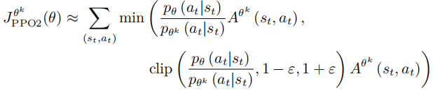

# PPO(近端策略优化)

## 1. 预备知识

### 同策略与异策略

在强化学习里面，

* 如果要学习的智能体和与环境交互的智能体是相同的，称之为**同策略**,
* 如果要学习的智能体和与环境交互的智能体不是相同的，称之为**异策略**.

在策略梯度中，演员与环境交互搜集数据，产生很多的轨迹 τ，根据搜集到的数据按照策略梯度的公式更新策略的参数，所以策略梯度是一个同策略的算法。PPO 是策略梯度的变形，也是同策略的算法。

$$
\bigtriangledown \bar{R}_\theta =\mathbb{E}_{\tau \sim p_\theta (\tau )}[R(\tau )\bigtriangledown \log p_\theta (\tau )]
$$

## 2. PPO实现

repo：https://github.com/NoneJou072/rl-notebook
接下来具体地介绍每一个模块的实现。

### 2.1 动作采样

```python
    @torch.no_grad()
    def sample_action(self,state):
        state = torch.tensor(state, device=self.device, dtype=torch.float32).unsqueeze(dim=0)
        dist = self.actor.get_dist(state)
        action = dist.sample()
        self.log_probs = dist.log_prob(action).detach().cpu().numpy().flatten()
        return action.detach().cpu().numpy().flatten()
```

在深度学习中，神经网络通常接受批量数据作为输入。这意味着输入数据通常具有批量维度，即一个维度用于表示输入数据的批量大小。例如，如果批量大小为32，则输入张量的形状将是(32, ...)。
在给定状态的情况下，我们希望将其作为一个批量大小为1的输入传递给神经网络模型。为了满足这个要求，我们需要在输入状态的维度上增加一个维度，使其形状变为(1, ...)，其中第0个维度表示批量大小为1。
通过使用unsqueeze(dim=0)函数，我们可以在张量的第0个维度上增加一个维度，确保输入状态符合模型的输入要求。在代码中，它将状态张量的形状从(N, ...)（N是状态的维度）变为(1, N, ...)，将其转换为一个批量大小为1的张量。

### 2.2 产生经验的过程

已知一个状态 $ s_t $ , 通过 actor 网络得到所有动作的概率 $\pi(a|s_t)$，根据这些概率生成该状态下动作的概率分布，然后按照概率分布去采样得到动作 $a_t$, 然后将 $a_t$ 输入到环境中, 得到 $s_{t+1}$ 和 $r_{t+1}$, 这样就得到一个 experience:$s_t,a_t,s_{t+1},r_{t+1}$, 然后将该 experience 放入经验池中。
经验池 存在的意义是为了消除experience的相关性，因为强化学习中前后动作通常是强相关的，而将它们打散，放入经验池中，然后在训练神经网络时，随机地从经验池中选出一批experience，这样能够使神经网络训练地更好。

### 2.3 经验回放

我们定义了参数 `update_freq` 用于设定智能体更新策略的频率，即执行 `update()` 的频率。在更新策略时，我们首先从经验回放缓冲区中获取训练数据, 在PPO算法中，经验回放被用于计算优势估计（advantage estimation）和值函数目标（v_target），并不是典型的经验回放机制。

```python
    old_states, old_actions, old_log_probs, new_states, old_rewards, old_dones = self.memory.sample_tensor(self.device)
```

计算完优势后，执行 `K_epochs` 次循环来优化策略和值函数。在每个循环中，使用 `BatchSampler` 来进行小批量采样，其中使用 `SubsetRandomSampler` 打乱给定的索引范围列表，这样就可以从索引范围中随机选择样本，以生成小批量样本。

```python
    for index in BatchSampler(SubsetRandomSampler(range(self.batch_size)), self.mini_batch_size, False):
        dist_now = self.actor.get_dist(s[index])
```

需要注意的是，我们没有显式地使用经验回放缓冲区来存储和采样经验数据。相反，它一次性获取所有的经验数据，然后在每个循环中使用BatchSampler来随机采样小批量样本。这种方式是为了简化代码和减少存储开销，但同时也限制了经验数据的复用和随机性。

### 2.4 策略更新

下面是我们要优化的目标函数：

$$
J^{\theta '}(\theta) =\mathbb{E}_{(s_t,a_t) \sim \pi _{\theta '}}[\frac{p_\theta (a_t | s_t)}{p_{\theta '}(a_t | s_t))}A^{\theta '}(s_t,a_t)]
$$

$$
J^{\theta '}_{PPO}(\theta)  = J^{\theta '}(\theta)  - \beta KL(\theta,\theta ')
$$

#### 2.4.1 GAE

使用 GAE（Generalized Advantage Estimation，广义优势估计）计算优势值 $A^\theta (s_t, a_t)$ ，优势值是通过对比当前策略与旧策略在相同状态下的动作价值来计算的。它用于衡量当前策略相对于旧策略在某个状态下所能获得的优势或增益。优势值的计算代表了当前策略相对于旧策略在某个状态下的价值提升或下降程度。如果优势值为正，则表示当前策略比旧策略在该状态下更好；如果优势值为负，则表示当前策略比旧策略在该状态下较差。

$$
\hat{A}_t^{GAE(\gamma,\lambda)}=\sum_{l=0}^{\infty} (\gamma \lambda)^l \delta_{t+1}^V
$$

GAE的实现过程如下：

1. 收集样本数据：使用当前策略在环境中执行一系列的动作，收集样本数据，包括状态、动作、奖励等信息。

   ```python
       old_states, old_actions, old_log_probs, new_states, old_rewards, old_dones = self.memory.sample_tensor(self.device)
   ```
2. 价值计算：使用一个价值函数（通常是一个神经网络），根据当前策略评估每个状态下动作的价值。这可以是状态值函数（Value Function）或者是动作值函数（Q-Function）。

   ```python
       values = self.critic(old_states) 
       new_values = self.critic(new_states)
   ```
3. 计算每个时间步的TD（Temporal Difference）误差，即当前奖励加上下一个状态值的估计，再减去当前状态值的估计。这个TD误差代表了当前状态值的估计与下一个状态值的估计之间的差异。

   $$
   \delta_t^V=r_t+\gamma V_\omega(s_{t+1})-V_\omega(s_t)
   $$

   ```python
       deltas = old_rewards +  self.gamma * values - new_values
   ```
4. 计算广义优势

   ```python
       adv = []
       gae = 0
       for delta, done in zip(reversed(deltas.flatten().cpu().numpy()), reversed(old_dones.flatten().cpu().numpy())):
       gae = delta + self.gamma * self.gae_lambda * (1 - done) * gae
       adv.insert(0, gae)
   ```

   通常使用一个衰减因子（通常是γ，表示折扣率）对TD误差进行加权累积计算，以获得广义优势。衰减因子控制了对未来奖励的权重，使得更远的奖励对优势的贡献较小。
5. 为了稳定训练过程，通常会对广义优势进行标准化处理，以减少优势估计的方差。这通常包括减去均值并除以标准差，使其具有零均值和单位方差。具体地，使用GAE计算完一个batch中的advantage后，计算整个batch中所有advantage的mean和std，然后减去均值再除以标准差。

   ```python
       # advantage normalization-batch adv norm
       adv = torch.tensor(adv, device=self.device, dtype=torch.float32).view(-1, 1)
       adv = (adv - adv.mean()) / (adv.std() + 1e-5) # 1e-5 to avoid division by zero

   ```

通过计算优势值，PPO算法可以根据优势值的正负来进行策略更新，以鼓励良好的改进并抑制较差的改变。具体的策略更新步骤可能会使用一些近似方法，例如使用概率比率剪切（Clipping）或使用近似的概率比率损失函数来实现。这些步骤有助于确保策略更新在每次迭代中都是小步骤，并且与旧策略之间的差异控制在一个可接受的范围内。

#### 2.4.2 新旧策略差异

ppo算法最精髓的地方就是加入了一项比例用以描绘新老策略的差异。
我们计算策略 $\theta$ 和 $\theta '$ 在状态 $s_t$ 下选择 $a_t$ 的条件概率，并计算它们的比值 $\frac{p_\theta (a_t | s_t)}{p_{\theta '}(a_t | s_t))}$ 。

```python
    # get new action probabilities
    probs = self.actor(old_states)
    dist = Categorical(probs)
    new_probs = dist.log_prob(old_actions)
    # compute ratio (pi_theta / pi_theta__old):
    # a/b=exp(log(a)-log(b))
    ratio = torch.exp(new_probs - old_log_probs) 
```

其中，old_log_probs 是之前从 replay buffer 中采样出来的，是我们使用示范 $\theta '$ 与环境交互时得到的对数概率。probs 是使用策略网络根据旧状态预测动作的概率，然后根据这个概率创建一个 Categorical 概率分布，再以此计算旧动作在新策略下的概率。

#### 2.4.3 损失计算

1. Actor 网络损失计算
   由于传统 PPO 的 KL 散度计算较为复杂，我们使用 PPO-clip，即**近端策略优化裁剪**的方法。近端策略优化裁剪的目标函数里面没有 KL 散度，其要最大化的目标函数为
   

```python
    # compute surrogate loss
    surr1 = ratio * advantage
    surr2 = torch.clamp(ratio, 1 - self.eps_clip, 1 + self.eps_clip) * advantage
    # compute actor loss
    actor_loss = torch.min(surr1, surr2).mean()
```

2. Critic 网络损失计算

```python
    critic_loss = F.mse_loss(discounted_rewards, values)
```

trick: Policy Entropy
在信息论与概率统计中，熵(entropy)是表示随机变量不确定性的度量。在强化学习中，策略的熵可以表示为：

一个策略的熵越大，意味着这个策略选择各个动作的概率更加“平均”。在PPO中，为了提高算法的探索能力，我们一般在actor的loss中增加一项策略熵，并乘以一个系数entropy_coef，使得在优化actor_loss的同时，让策略的熵尽可能大。一般我们设置entropy_coef=0.01。

```python
    actor_loss = -torch.min(surr1, surr2).mean() - self.entropy_coef * dist.entropy().mean()
```
