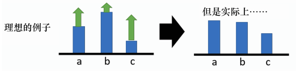
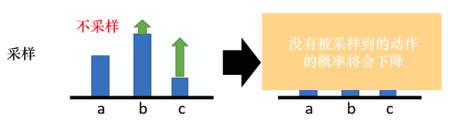

## 策略梯度
---
假设目标策略是一个随机性策略，并且处处可微，我们一般用神经网络去近似策略函数 $\pi(a\mid s)$，称为策略网络 $\pi(a\mid s;\theta)$，其中  $\theta$ 表示神经网络的参数，初始时是随机的。
如果一个策略很好，那么状态价值 $V_\pi(S)$ 的均值应该很大，因此我们定义目标函数：

$$J(\theta)=\mathbb E_S\left[V_\pi(S) \right]$$

我们要让目标函数值越大越好，求解最大化问题，可以使用 **梯度上升**（gradient ascent）更新 $\theta$, 使 $J(\theta)$ 增大，表示为：

$$\theta_{new}\gets \theta_{new}+\beta\cdot\bigtriangledown_\theta J(\theta_{now})$$

其中，$\beta$ 表示学习率，是一个超参数。其中的梯度 $\bigtriangledown_\theta J(\theta_{now})$ 称为策略梯度，可以写成

$$\bigtriangledown_\theta J(\theta)=\mathbb{E}_S\left[\mathbb{E}_{A\sim\pi(\cdot\mid S;\theta)}\left[Q_\pi(S,A)\cdot\bigtriangledown_\theta\ln\pi(A\mid S;\theta)\right]\right]$$

由于上式的求解较为复杂，我们使用近似策略梯度的方法。我们每次观测到 S 中的一个状态 s，可以根据当前的策略网络随机抽样出一个动作 a，计算随机梯度

$$g(s,a;\theta):=Q_\pi(s,a)\cdot\bigtriangledown_\theta\ln\pi(a\mid s;\theta)$$

显然 $g(s,a;\theta)$ 是策略梯度 $\bigtriangledown_\theta J(\theta)$ 的无偏估计：
$$\bigtriangledown_\theta J(\theta)=\mathbb{E}_S\left[\mathbb{E}_{A\sim\pi(\cdot\mid S;\theta)}[g(S,A;\theta)]\right]$$

我们使用随机梯度上升来更新 $\theta$:
$$\theta\gets \theta+\beta\cdot g(s,a;\theta)$$

但由于我们不知道 $Q_\pi(s,a)$，所以无法计算出 $g(s,a;\theta)$ ，解决方法是对 $Q_\pi(s,a)$ 作近似。一种方法是 REINFORCE，用实际观测的回报 u
 近似，另一种方法是 actor-critic，用神经网络 $q(s,a;\omega)$ 近似。

## REINFORCE
---
由于动作价值定义为折扣回报 $U_t$ 的条件期望：
$$Q_\pi(s_t,a_t)=\mathbb E[U_t\mid S_t=s_t,A_t=a_t]$$

我们可以用蒙特卡洛方法近似上面的条件期望。从时刻 t 开始，智能体完成一个回合后，可以计算出 $u_t=\sum_{k=t}^n\gamma^{k-t}\cdot r_k$。因为 $u_t$ 是 随机变量 $U_t$ 的观测值，所以 $u_t$ 是上式中期望的蒙特卡洛方法近似。我们用 $u_t$ 代替 $Q_\pi(s_t,a_t)$，随机梯度就可以近似成

$$g(s_t,a_t;\theta)=u_t\cdot\bigtriangledown_\theta\ln\pi(a_t\mid s_t;\theta)$$

这样我们得到了训练策略网络的方法，即 REINFORCE。REINFORCE 是同策略的算法，要求行为策略和目标策略相同。

REINFORCE 算法的具体算法流程如下：

* 初始化策略参数 $\theta$
* for 序列 $e=1 \to E$ do :
    * 用当前策略采样轨迹 $\{s_1,a_1,r_1,s_2,a_2,r_2,\dots,s_T,a_T,r_T\}$
    * 计算当前轨迹每个时刻往后的回报 $u_t=\sum_{k=t}^n\gamma^{k-t}\cdot r_k$
    * 对 $\theta$ 进行更新，$\theta\gets \theta+\beta\cdot g(s,a;\theta)$
* end for

## 带基线的策略梯度
---
如果给定状态 s 采取动作 a，整场游戏得到正的奖励，就要增加(s, a) 的概率。如果整场游戏得到负的奖励，就要减小 (s, a) 的概率。但在很多游戏里面，奖励总是正的。

如下图所示，假设我们在某一个状态有 3 个动作 a、b、c 可以执行。根据策略梯度公式，我们要提高这3 个动作的概率和对数概率。但是它们前面的权重 $R(\tau)$ 是不一样的，权重小的，该动作的概率提高的就少；权重大的，该动作的概率提高的就多。因为对数概率是一个概率，所以动作 a、b、c 的对数概率的和是 0。所以提高少的，在归一化后，动作 b 的概率就是下降的；提高多的，该动作的概率才会上升。

这是一个理想的情况，本来这边应该是一个期望，对所有可能的 s 与 a 的对进行求和。但我们真正在学习的时候，因为我们做的是采样，只是采样了少量的 s 与 a 的对，有一些动作可能从来都没有被采样到。如下图所示，在某一个状态，虽然可以执行的动作有 a、b、c，但我们可能只采样到动作 b 或者只采样到动作 c，没有采样到动作 a。但现在所有动作的奖励都是正的，所以在这个状态采取 a、b、c 的概率都应该要提高。但因为 a 没有被采样到，所以其他动作的概率如果都要提高，a 的概率就要下降。所以 a 不一定是一个不好的动作，它只是没有被采样到。为了怎么解决这个问题，我们会希望奖励不总是正的。

为了解决奖励总是正的的问题，我们可以把奖励减 b

$$\bigtriangledown_\theta J(\theta)=\mathbb{E}_S\left[\mathbb{E}_{A\sim\pi(\cdot\mid S;\theta)}\left[(Q_\pi(S,A)-b)\cdot\bigtriangledown_\theta\ln\pi(A\mid S;\theta)\right]\right]$$

其中，b 称为基线。通过这种方法，我们就可以让 $R(\tau)-b$ 这一项有正有负。如果我们得到的总奖励 $R(\tau)>b$，就让 (s, a) 的概率上升。如果 $R(\tau)<b$，就算 $R(\tau)$ 是正的，也是不好的，我们就让(s, a) 的概率下降。b 怎么设置呢？我们可以对 τ 的值取期望，计算 τ 的平均值，令 b ≈ E[R(τ )]。所以在训练的时候，我们会不断地把 $R(\tau)$ 的值记录下来计算其平均值，把这个平均值当作 b 来使用。

## 带基线的 REINFORCE
---
在带基线的策略梯度中，我们使用状态价值 $V_\pi(s)$ 作为基线，得到策略梯度的一个无偏估计：

$$g(s,a;\theta):=[Q_\pi(s,a)-V_\pi(s)]\cdot\bigtriangledown_\theta\ln\pi(a\mid s;\theta)$$

在 REINFORCE 中，我们用实际观测的回报 u 来代替动作价值 $Q_\pi(s,a)$。此外，我们用一个神经网络 $v(s;\omega)$ 来近似状态价值函数 $V_\pi(s)$。这样，策略梯度又可以近似成

$$g(s,a;\theta):=[u-v(s;\omega)]\cdot\bigtriangledown_\theta\ln\pi(a\mid s;\theta)$$

另外，这种方法与 actor-critic 不同，价值网络只是用作基线，没有起到评论员的作用，目的在于减小方差、加速收敛。

训练价值网络的目的是让 $v(s_t;\omega)$ 拟合 $V_\pi(s_t)$，即拟合 $u_t$ 的期望，因此我们定义损失函数为

$$L(\omega)=\frac{1}{2n}\sum^{n}_{t=1}[v(s_t;\omega)-u_t]^2$$