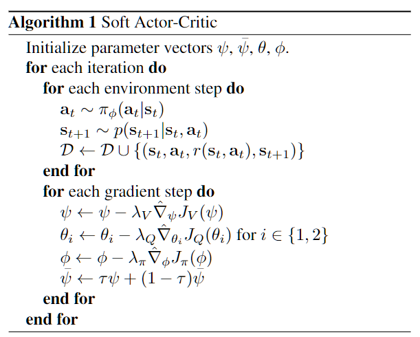

# SAC
Soft Actor-Critic (SAC) 是一个免模型(model-free)、异策略(off-policy)的深度强化学习算法。
  
伪代码解释：
在每一步中，我们使用当前的策略去采样动作

---

## Entropy
### A. 熵正则化
在信息论中，熵([entropy](https://en.wikipedia.org/wiki/Entropy_(information_theory)))体现了变量可能的结果的不确定性。在强化学习中，熵体现为策略的随机性。假设 x 的熵 H 是从分布 P 采样的，则熵表示为  

$$
H(P):=-\sum_{x \in P}p(x)\log{p(x)}=\mathbb{E}_{x\sim P}[-\log{P(x)}]
$$

在强化学习中，我们使用 $H(\pi (\cdot \mid s))$ 来表示策略 $\pi$ 在状态 s 下的随机程度。  
**最大熵强化学习（maximum entropy RL）** 的思想就是除了要最大化累积奖励，还要使得策略更加随机。如此，策略函数的目标中就加入了一项熵的正则项，定义为
$$
 \pi^*=\underset{\pi}{argmax} \mathbb{E}_\pi\left [\sum_{t}r(s_t,a_t)+\alpha H(\pi (\cdot \mid s))\right ]
$$
其中，$\alpha$ 是一个正则化的系数，用来控制熵的重要程度。熵正则化增加了强化学习算法的探索程度，$\alpha$ 越大，探索性就越强，有助于加速后续的策略学习，并减少策略陷入较差的局部最优的可能性。

### B. 自动调整熵正则项
在 SAC 算法中，如何选择熵正则项的系数非常重要。在不同的状态下需要不同大小的熵：在最优动作不确定的某个状态下，熵的取值应该大一点；而在某个最优动作比较确定的状态下，熵的取值可以小一点。为了自动调整熵正则项，SAC 将强化学习的目标改写为一个带约束的优化问题：
$$
 \underset{\pi}{max} \mathbb{E}_\pi[\sum_{t}r(s_t,a_t)] \quad s.t.\quad \mathbb{E}_{(s_t,a_t)\sim \rho_\pi}[-\log (\pi_t(a_t\mid s_t))] \ge \mathcal H_0
$$
也就是最大化期望回报，同时约束熵的均值大于 $\mathcal H_0$ (文章中 $\mathcal H_0=−dim(a)$ ) 。通过一些数学技巧化简后，得到 $\alpha$ 的损失函数：
$$
 L(\alpha)=\mathbb{E}_{s_t \sim R, a_t \sim \pi(\cdot \mid s_t)}[-\alpha \log \pi(a_t\mid s_t)-\alpha \mathcal H_0]
$$
* 当策略的熵低于目标值 $\mathcal H_0$ 时，训练目标 $L(\alpha)$ 会使 $\alpha$ 的值增大，进而在最小化策略网络的损失函数的过程中增加了策略熵对应项的重要性；
* 当策略的熵高于目标值 $\mathcal H_0$ 时，训练目标 $L(\alpha)$ 会使 $\alpha$ 的值减小，进而使得策略训练时更专注于价值提升。

---

## soft update
### A. Soft 贝尔曼
soft贝尔曼与贝尔曼方程的表达式形式上一样，
$$
Q_{soft}(s_t,a_t)=r(s_t,a_t)+\gamma E_{s_{t+1}}[V_{soft}(s_{t+1})]
$$
不同的是Q函数和状态函数的表达。定义在最大熵框架下的Q函数，用 soft-Q 来表示，只是比原来的Q函数在每一步上多了一个熵：
$$
Q_{soft}(a_t,s_t)=r(s_t,a_t)+E_{(s_{t+1},\dots)\sim \rho}\left [\sum^{\infty}_{l=1}\gamma^l(r_{t+l}+H(\pi(\cdot \mid s_{t+l}))) \right ] 
$$
同理也可以像原来那样定义soft V
$$
\begin{equation*}
\begin{aligned}
V_{soft}(x) &= E_{a_t \sim \pi}\left [ Q_{soft}(a_t,s_t)-\log {\pi(a_t\mid s_t)} \right ] \\
&= E_{a_t \sim \pi}\left [ Q_{soft}(a_t,s_t) \right ]+H(\pi(\cdot \mid s_{t}))\\
\end{aligned}
\end{equation*}
$$
和原来的q-learning相比，策略的迭代方式发生了改变，原来在value-based框架下我们是通过Q函数直接选取策略进行policy iteration和policy improvement的，但是现在我们的策略不再是确定性的，而是从Soft-Q中根据softmax产生了一个随机策略，策略improvement不再是q-learning中的argmax，而这也是soft-q的核心概念，正是这种策略的改进方式也决定了我们的最优策略是一个随机策略，而不是deterministic的。

---
## 参考文献
1. [动手学强化学习-SAC](https://hrl.boyuai.com/chapter/2/sac%E7%AE%97%E6%B3%95/#147-%E5%8F%82%E8%80%83%E6%96%87%E7%8C%AE)
2. [Soft-Q-Learning](https://zhuanlan.zhihu.com/p/430792032)
3. https://spinningup.openai.com/en/latest/algorithms/sac.html
4. https://github.com/Lizhi-sjtu/DRL-code-pytorch/blob/main/8.SAC/SAC-continuous.py