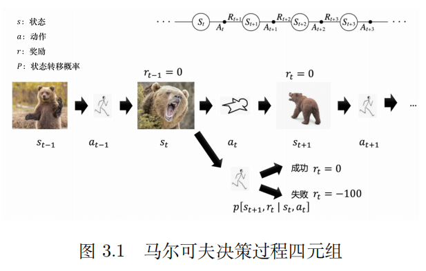
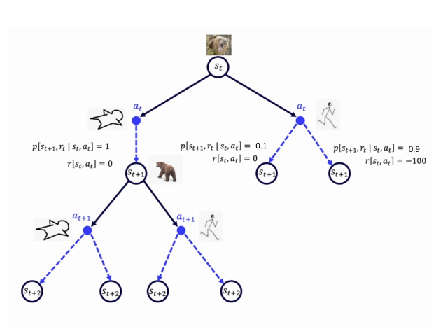
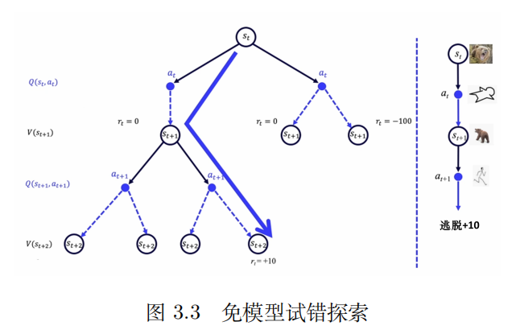
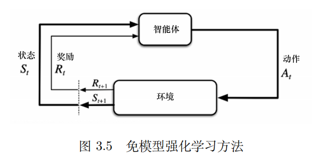
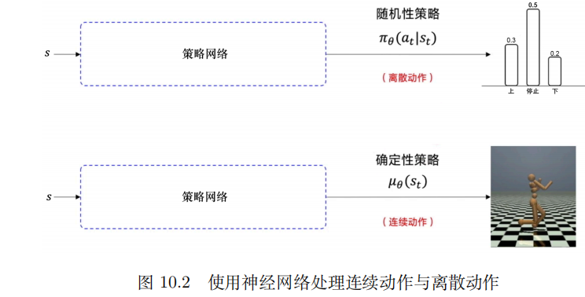
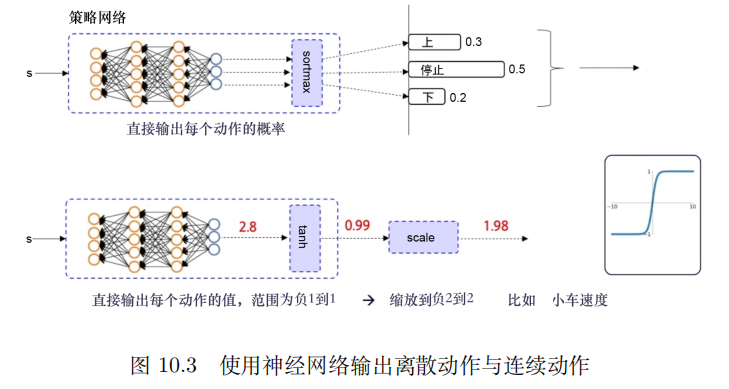

# 0.马尔可夫奖励过程

马尔可夫奖励过程（MRP）是马尔可夫链加上**奖励函数**，奖励函数 R 是一个期望，表示到达某一个状态时可以获得多大的奖励。如果状态数是有限的，那么 R 可以是一个向量。

​​

其中定义了几个概念：
1.**范围 h**（horizon）：指一个回合的长度；
2.**折扣回报 G**​**~t~**（discounted return）：指把奖励 r 进行**折扣**再**逐步叠加**后所获得的奖励。

$G(t)=r_{t+1}+\gamma r_{t+2}+\gamma^2r_{t+3}+\dots+\gamma^{T-t-1}r_T$

其中，γ 为折扣因子，用来折扣未来的奖励；

3.**状态价值函数 Vt**（state-value function）：对于马尔可夫奖励过程，**状态价值函数被定义成回报的期望**，即从这个状态开始，我们可能获得多大的价值。

$V^t(s)=\mathbb{E} \left [G_t \mid s_t=s \right ] \\=\mathbb{E} \left [r_{t+1}+\gamma r_{t+2}+\gamma^2r_{t+3}+\dots+\gamma^{T-t-1}r_T \mid s_t=s \right ] \\=\mathbb{E} \left [r_{t+1}+\gamma V^{t+1}(s_{t+1})  \mid s_t=s \right ]$

# 1.**贝尔曼**方程

对于上面提到的状态价值函数，等价于

$V(s)=R(s)+\gamma \sum_{s'\in S}p(s'| s) V(s')$

其中，第一项 R(s) 表示当前状态所获得的奖励，第二项表示未来奖励的折扣总和。
s′：未来的某一状态；
s：当前状态；
V(s′)：未来某一状态的价值；
p：从当前状态到未来某一状态的概率。

这个方程就是**贝尔曼方程(Bellman Equation)**，它表示了当前状态与未来状态的迭代关系。

对于状态很少的马尔可夫奖励过程，可以把贝尔曼方程写成矩阵的形式，通过矩阵运算求解状态价值。
对于状态很多的马尔可夫奖励过程，使用迭代的方法，如**动态规划、蒙特卡洛、时序差分学习方法**。

1. **蒙特卡洛法**
   蒙特卡洛法使用采样的思想，从某个状态开始，采样一定量的轨迹，每段轨迹都会得到一个奖励，折扣后得到回报 g，将回报积累起来，得到总的回报 Gt，除以轨迹数量得到平均值，即为该状态的价值。
   ​
2. **动态规划法**
   通过**自举**的方法不停迭代贝尔曼方程，当最后更新的状态与我们上一个状态的区别并不大的时候，更新就可以停止，输出最新的 V ′(s) 作为它当前的状态的价值。动态规划的方法基于后继状态价值的估计来更新现在状态价值的估计，根据其他估算值来更新估算值的思想，我们称其为**自举**。
   ​​

‍

# 2.马尔可夫决策过程

相较于马尔可夫奖励过程，马尔可夫决策过程(Markov decision process, MDP)多了决策，即选择动作的过程，状态转移与奖励函数也多了动作的条件。未来的状态不仅依赖于当前的状态，也依赖于在当前状态智能体采取的动作。马尔可夫决策过程满足条件：
​​

$p (s_{t+1}, r_t \mid s_t, a_t)$ 表示在状态 s~t~ 选择动作 a~t~ 的时候，**转移**到状态 s~t+1~ 后得到奖励 r~t~ 的概率是多少。

马尔可夫决策过程就是**序列决策**的经典的表现方式。状态、动作、状态转移概率和奖励组成的集合 (S、A、P、R) 构成了强化学习中马尔可夫决策过程的四元组，一般会再加上折扣因子构成五元组。

> **序列决策：**
>
> 强化学习是一个与时间相关的序列决策的问题。例如，在 t − 1 时刻，我看到熊对我招手，下意识的动作就是逃跑。熊看到有人逃跑，就可能觉得发现了猎物，并开始发动攻击。而在 t 时刻，我如果选择装死的动作，可能熊咬咬我、摔几下就觉得挺无趣的，可能会走开。这个时候我再逃跑，可能就成功了，这就是一个序列决策过程。
>
> ​​

‍

## 1.1 有模型

在 MDP 中，我们把可能的动作和可能的状态转移的关系画成树状。

​​

我们使用概率函数 P [s~t+1~, r~t~ | s~t~, a~t~] 和奖励函数 R [s~t~, a~t~] 来描述环境。(概率函数就是状态转移的概率，它反映的是环境的随机性）。如果我们知道<u>概率函数</u>和<u>奖励函数</u>，马尔可夫决策过程就是已知的，我们可以通过策略迭代和价值迭代来找最佳的策略。

==如果我们知道环境的==​<u>==状态转移概率==</u>​==和==​<u>==奖励函数==</u>​==，就可以认为这个==​**==环境是已知的==**​==（即==​**==有模型==**​==）==，因为我们用这两个函数来描述环境。如果<u>环境是已知</u>的，我们可以用**动态规划算法**来找能够逃脱的概率最大的最佳策略是什么。

​​

## 1.2 免模型

大部分情况下环境是未知的，也就是这一系列的决策的<u>概率函数</u>和<u>奖励函数</u>是未知的，称为免模型。

==例如，因为现实世界中人类第一次遇到熊时，我们根本不知道能不能逃脱，所以 0.1、0.9 的概率都是虚构出来的概率。==

​​

强化学习通过尝试不同的路了解哪个状态会更好。

强化学习<u>用价值函数 V (S) 来表示状态的好坏</u>，<u>用 Q 函数来判断在某状态下采取什么动作能够取得最大奖励。</u>

免模型强化学习方法没有获取环境的状态转移和奖励函数，而是让智能体与环境进行交互，采集大量的轨迹数据，智能体从轨迹中获取信息来改进策略，从而获得更多的奖励。

​​

# 3.策略

策略 π 定义了**在某一个状态应该采取什么样的动作**。知道当前状态后，我们可以把当前状态代入策略函数来得到一个概率，即
​
策略的输出不一定是一个概率，可能直接告诉我们当前应该采取什么样的动作。

在 MDP 中，回报的期望基于当前采取的策略。当策略决定后，我们通过对策略进行采样来得到一个期望，计算出它的
价值函数：

​

对于连续的动作，Q-Learning、DQN 等算法是没有办法处理的，我们可以使用神经网络来解决这个问题。如下图所示，在离散动作的场景下，有几个动作，神经网络就输出几个概率值。在连续的动作场景下，比如我们要输出机械臂弯曲的角度，我们就令神经网络输出一个浮点数。

我们再对**随机性策略**与**确定性策略**进行解释。

**随机性策略: ​**策略函数的输入是状态 s 和动作 a，输出是一个 0 到 1 之间的概率值，即采取某一个动作的可能性是有一个概率的，根据概率随机抽取一个动作。我们用 π~θ~(a~t~ |s~t~) 来表示这个随机性的策略。

**确定性策略: ​**确定性策略把状态 s 作为输入，直接输出动作 $a=\mu(s)$, 而不是概率值。这样对于给定的状态 s，作出的决策 a 是确定的，没有随机性。我们用 µ~θ~(s~t~) 来代表这个确定性的策略。

​​

另外，如下图所示，要输出离散动作，我们就加一个 softmax 层来确保所有的输出是动作概率，并且所有的动作概率和为 1。要输出连续动作，我们一般可以在输出层加一层 tanh 函数。tanh 函数的作用就是把输出限制到 [−1,1] ，再根据实际动作的范围将将输出缩放，然后再输出给环境。比如神经网络输出一个浮点数 2.8，经过 tanh 函数后被限制在 [−1,1] 之间，输出 0.99，假设小车速度的范围是 [−2,2] ，我们按比例从 [−1,1] 扩大到 [−2,2]，即令 0.99 乘 2，最终输出给环境的小车速度就是 1.98。

​​

​

# 4.状态转移

**状态转移**（state transition）是指智能体从当前 t 时刻的状态 s 转移到下一个时刻的状态 s' 的过程。**状态转移概率是具有马尔可夫性质的（系统下一时刻的状态仅由当前时刻的状态决定，不依赖于以往任何状态）**。强化学习通常假设状态转移是随机的，我们用状态转移函数来描述状态转移：

$p(s'\mid s, a)=\mathbb P(S'_{t+1}=s'\mid S_t=s,A_t=a)$

表示在当前状态 s，智能体执行动作 a，环境的状态变成 s' 的发生概率。

已知马尔可夫决策过程和策略 π，我们可以直接对动作进行加和，去掉 a，这样我们就可以得到**马尔可夫决策过程对于马尔可夫奖励过程的状态转移函数**：
​
如下图所示，马尔可夫过程/马尔可夫奖励过程的状态转移是直接决定的。**而在马尔可夫决策过程中，智能体先要决定采取某一个动作**，即在当前状态与未来状态转移过程中多了一层决策性。
​​

# 6.动作价值函数

价值函数泛指状态价值函数，一般不说动作价值函数，而是说 Q 函数。

Q 函数定义的是在某一个状态采取某一个动作，它可能得到的**回报的期望**，即

$Q_\pi(s,a)=\mathbb{E}_\pi \left [G_t \mid s_t=s,a_t=a \right ]$

表示从这个动作开始，我们可能获得多大的价值。
对 Q 函数中的动作进行加和，就可以得到价值函数：

$V_\pi(s_t)=\mathbb E_{A_t\sim\pi(\cdot \mid s_t)}\left[Q_\pi(s_t,A_t) \right] \\ =\sum_{a\in \mathcal A}\pi(a\mid s_t)\cdot Q_\pi(s_t,a)$

对 Q 函数的贝尔曼方程进行推导：
​​

‍